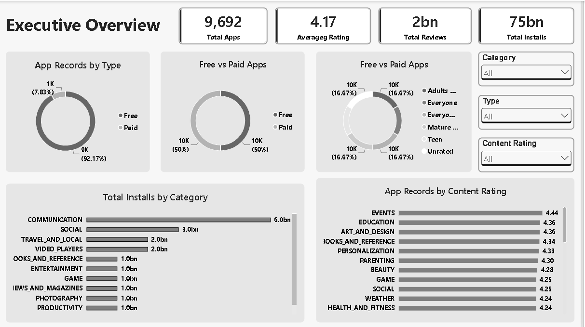
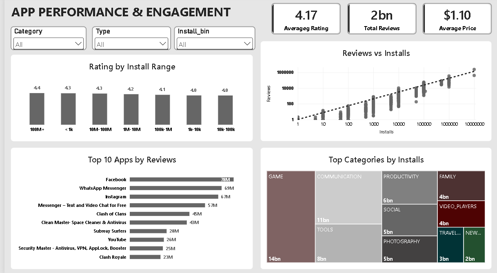

# Google Play Store Analytics

An end-to-end **Google Play Store Analytics project** built using **Power BI** to analyze app performance, user engagement, ratings, installs, reviews, and sentiment.

The project combines app-level data with user review sentiment to identify patterns in app popularity, ratings, engagement, and user satisfaction.

---

## Project Overview

The Google Play Store contains thousands of applications across multiple categories, genres, pricing models, and content ratings.

The objective of this project is to transform raw Google Play Store data into meaningful business insights by analyzing:

- App ratings and reviews
- Installs and user engagement
- Free vs Paid applications
- App categories and genres
- App size and pricing
- Content ratings
- App update activity
- User sentiment from reviews
- Relationship between ratings and sentiment

The final output is an interactive **3-page Power BI dashboard** supported by detailed business-question analysis.

---

## Business Objectives

The project aims to answer key business questions such as:

- Which app categories have the highest ratings and installs?
- Which applications have the highest user engagement?
- How do free and paid apps differ in performance?
- Does app size influence installs?
- Does price influence app ratings?
- How does sentiment vary across rating groups?
- Which genres have stronger user ratings?
- How has app update activity changed over time?
- What factors are associated with higher user satisfaction?

---

## Dataset

The project uses two primary datasets:

### 1. Google Play Store App Dataset

Contains information about applications available on the Google Play Store.

Important fields include:

- App
- Category
- Rating
- Reviews
- Installs
- Type
- Price
- Size
- Content Rating
- Genres
- Last Updated

### 2. Google Play Store User Reviews Dataset

Contains user reviews and sentiment information.

Important fields include:

- App
- Translated Review
- Sentiment
- Sentiment Polarity
- Sentiment Subjectivity

### Dataset Size

| Dataset | Approx. Records |
|---|---:|
| App Dataset | 10K+ |
| User Reviews Dataset | 64K+ |
| Final Unique App Dimension | 9.6K+ |

---

## Tech Stack

| Tool | Purpose |
|---|---|
| **Power BI** | Data modeling, analysis & dashboard development |
| **Power Query** | Data cleaning & transformation |
| **DAX** | Measures, KPIs & analytical calculations |
| **Excel / CSV** | Source data |
| **Git & GitHub** | Version control & project documentation |

---

## Project Workflow

```text
Raw Data
   ↓
Data Cleaning
   ↓
Data Transformation
   ↓
Data Modeling
   ↓
DAX Measures
   ↓
Exploratory Analysis
   ↓
Business Questions
   ↓
Power BI Dashboard
   ↓
Business Insights & Recommendations

```
---

## Data Preparation

The datasets were prepared using **Power Query** and **Power BI transformations**.

Key preparation activities included:

- Removing duplicate application records
- Handling missing values
- Cleaning inconsistent data types
- Converting install values into numeric format
- Standardizing price values
- Creating app size groups
- Creating install-range groups
- Creating rating groups
- Preparing review sentiment fields
- Creating a final app-level dimension
- Establishing relationships between app and review data


## Data Model

The final Power BI model uses a structured data model consisting of:

- `dim_App`
- `dim_AppName_Final`
- `fact_Reviews`
- `Measures Table`

The model connects application-level information with review-level sentiment data to enable cross-analysis between:

**App Performance → Ratings → Reviews → Sentiment**

---

## Dashboard Preview

### Executive Overview Dashboard



### App Performance & Engagement



### Reviews & Sentiment Analysis


## Key Findings

| Rating Group | Avg. Sentiment Polarity |
|---|---:|
| High Rated | **0.19** |
| Medium Rated | **0.11** |
| Low Rated | **-0.07** |
| Unrated | **0.21** |

High-rated applications generally have more positive review sentiment, while low-rated applications show more negative sentiment.

## Sentiment Distribution

- **High Rated Apps:** 38.08% Positive, 12.56% Negative
- **Low Rated Apps:** 13.89% Positive, 18.61% Negative

| Rating Group | Avg. Sentiment Polarity |
| ------------ | ----------------------: |
| High Rated   |                **0.19** |
| Medium Rated |                **0.11** |
| Low Rated    |               **-0.07** |
| Unrated      |                **0.21** |

User sentiment broadly aligns with application ratings. Positive reviews are more common among highly rated applications, while negative sentiment increases among low-rated applications.

## Business Insights

The analysis highlights several important patterns:

Popularity does not guarantee satisfaction
Apps with very high install volumes do not necessarily have the highest ratings.
Free apps dominate the marketplace
The majority of applications are free, and they also generate substantially higher review volumes.
User sentiment reflects ratings
Higher-rated applications generally receive more positive review sentiment.
App size is not a strong driver of installs
Large applications can achieve high installs, but app size alone does not explain popularity.
Category matters
Certain categories consistently achieve higher average ratings and install volumes.
App maintenance is important
Update activity increased considerably over time, highlighting the importance of continuous application development and maintenance.

## Recommendations

Based on the analysis, app developers and product teams should:

Focus on user experience and satisfaction, not only download volume.
Monitor user reviews and sentiment to identify product issues.
Prioritize regular updates and maintenance.
Analyze category-specific trends before launching new applications.
Avoid assuming that higher pricing or larger app size automatically leads to better performance.
Use review sentiment as an additional indicator alongside ratings and install metrics.


##  Project Structure

```text
Google-Play-Store-Analytics/
│
├── Dashboard/
│   ├── App_performance_and_engagement.png
│   ├── Executive_Overview_dashboard.png
|   ├── Reviews_and_sentiment_analysis.png
│   └── powerbi_dashboard_file.pbix
│
├── Data/
│   ├── Clean Data/
|   |   ├── App_update_history.dax
|   |   ├── Apps_Cleaned.csv
|   |   └──  Reviews_Cleaned.csv
│   └── Raw Data/
|       ├── googleplaystore_user_reviews.csv
|       ├── googleplaystore.csv
|       └── license.txt
│
├── Documentation/
|   ├── App Insights (PowerBI).pdf
│   ├── Data_Dictionary.md
|   ├── data_preparation_and_modeling.md
│   └── Question_Wise_Analysis.md 
│
├── PowerBI/
│   └── Google_Play_Store_Analytics.pbix
|
├── Report/
│   └── Google_Play_Store_Analytics_Project_Report.pdf
│
├── README.md
└── .gitignore
```